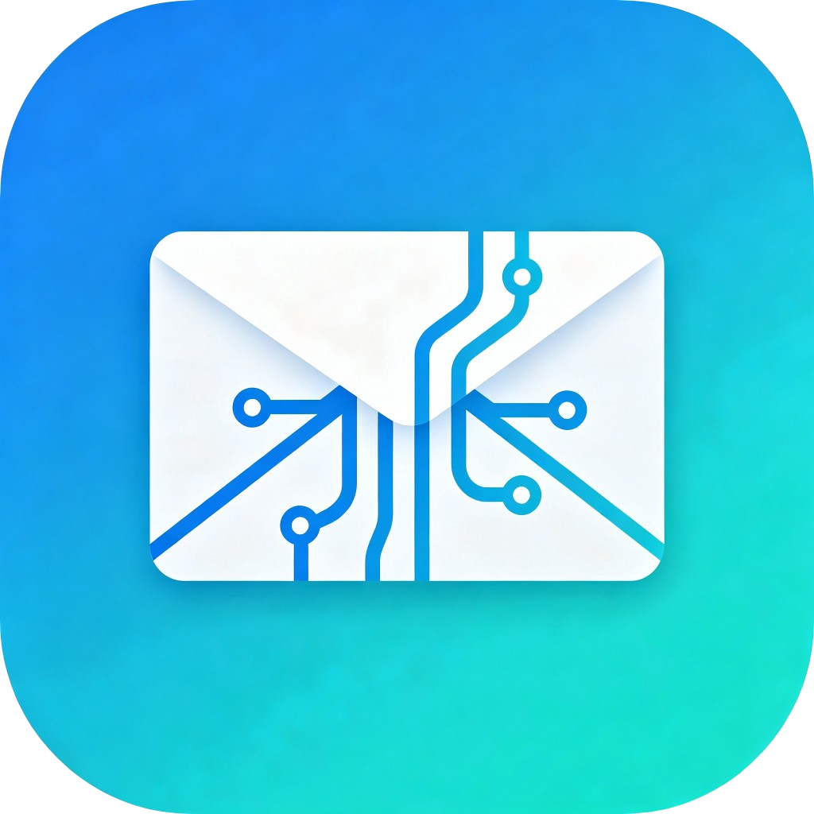
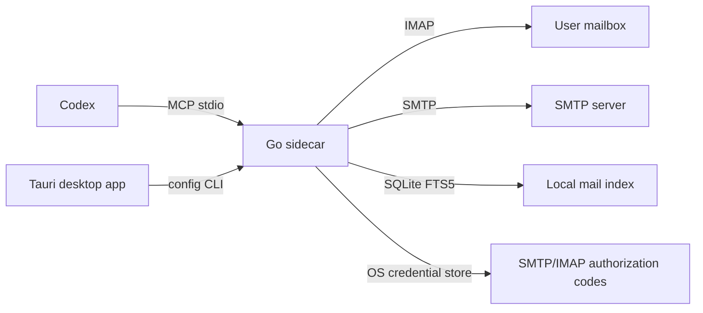

<p align="center">
  
</p>

<h1 align="center">Email MCP</h1>

<p align="center">
  Local desktop email tools for Codex, powered by a Go MCP sidecar and a Tauri settings app.
</p>

<p align="center">
  <a href="#overview">Overview</a> ·
  <a href="#architecture">Architecture</a> ·
  <a href="#key-features">Key Features</a> ·
  <a href="#getting-started">Getting Started</a> ·
  <a href="#mcp-tools">MCP Tools</a> ·
  <a href="#development">Development</a>
</p>

<p align="center">
  
  
  
  
  
  
  
</p>

---

## Overview

Email MCP is a local desktop email MCP server for Codex. It lets Codex read, search, organize, and send email through a user-owned local sidecar instead of a remote service.

The desktop app is a configuration center. Codex talks directly to the local Go sidecar through stdio, so MCP tools can work even when the GUI is closed.

Email MCP is designed around a narrow trust boundary:

- No remote HTTP service.
- No shared token store.
- No registration flow.
- No administrator approval page.
- No mailbox authorization codes in app logs or JSON config.

## Architecture



Core components:

| Component | Purpose |
| --- | --- |
| Go sidecar | `email-mcp mcp` exposes the stdio MCP server for Codex. |
| Config CLI | `email-mcp config ...` manages non-secret config and OS credential-store secrets. |
| Doctor CLI | `email-mcp doctor --json` reports local readiness. |
| Index CLI | `email-mcp index ...` manages the local SQLite/FTS mailbox index. |
| Desktop GUI | `apps/desktop` provides a Tauri + React settings center. |

## Key Features

- Local MCP server over stdio for Codex integration.
- IMAP mail listing, folder discovery, search, and full-message retrieval.
- SMTP sending with local attachment allowlists.
- SQLite/FTS5 mailbox index for fast local search.
- Attachment downloads constrained to a configured directory.
- Bulk mailbox operations with dry-run defaults.
- Desktop setup flow for mailbox settings, permissions, diagnostics, and Codex config installation.
- Windows and macOS packaging through Tauri and GitHub Actions.

## Getting Started

### 1. Configure Email MCP

After installing the desktop app:

1. Open Email MCP.
2. Configure mailbox host, port, account, SMTP authorization code, and IMAP authorization code.
3. Configure attachment download and allowed send-attachment directories.
4. Enable the required permissions.
5. Open the **Codex** page and install the MCP configuration.

The desktop app writes this block into Codex config and creates a backup first:

```toml
[mcp_servers.email]
command = "<installed email-mcp path>"
args = ["mcp"]
```

### 2. Run Diagnostics

Use the GUI **Status** page, or run:

```powershell
.\email-mcp-service.exe doctor --json
```

### 3. Build The Mail Index

```powershell
.\email-mcp-service.exe index status
.\email-mcp-service.exe index sync --limit-per-folder 1000
```

Search the local index:

```powershell
@'
{"keyword":"invoice","limit":20}
'@ | .\email-mcp-service.exe index search
```

## MCP Tools

Email MCP exposes primitive, auditable mailbox operations. Higher-level tasks such as invoice filtering, attachment review, amount extraction, report writing, and mailbox cleanup are handled by Codex using these tools.

| Area | Tools |
| --- | --- |
| Read | `listEmails`, `listEmailsV2`, `listFolders`, `searchAllFolders`, `getEmail` |
| Local index | `searchEmails` |
| Attachments | `downloadEmailAttachments` |
| Send | `sendEmail` |
| Folders | `createFolder`, `resolveSpecialFolders` |
| Message state | `setEmailReadStatus`, `moveEmail`, `deleteEmail` |
| Bulk operations | `bulkMoveEmails`, `bulkDeleteEmails`, `bulkSetEmailReadStatus`, `archiveEmails` |
| Organization workflow | `previewOrganizePlan`, `applyOrganizePlan` |

Mailbox organization should be previewed first with `previewOrganizePlan` or the bulk tools' default dry-run behavior, then executed only after confirmation.

## Desktop Install

### Windows

Build the installer on Windows:

```powershell
cd apps/desktop
npm install
npm run tauri:build
```

The installer is written to:

```text
apps/desktop/src-tauri/target/release/bundle/nsis/
```

### macOS

macOS `.dmg` and `.app` packages must be built on macOS.

Recommended path: use GitHub Actions.

1. Push this repository to GitHub.
2. Open **Actions**.
3. Run **Build macOS package**.
4. Download the `email-mcp-macos` artifact.
5. Open the `.dmg` and drag `Email MCP.app` into `/Applications`.

Local build path from a Mac:

```bash
xcode-select --install
brew install node go rust
cargo install tauri-cli --version "^2" --locked

cd apps/desktop
npm ci
npm run tauri:build
```

The output is written under:

```text
apps/desktop/src-tauri/target/release/bundle/dmg/
apps/desktop/src-tauri/target/release/bundle/macos/
```

For unsigned internal builds, macOS may block the first launch. Use Control-click -> **Open**, or approve it from **System Settings -> Privacy & Security**.

## Config And Secrets

| Item | Location |
| --- | --- |
| Windows config | `%APPDATA%\EmailMCP\config.json` |
| macOS config | `~/Library/Application Support/EmailMCP/config.json` |
| SMTP/IMAP authorization codes | OS credential store |
| Local mailbox index | OS cache directory under `EmailMCP/mail-index.db`, unless a custom path is configured |
| Development fallback | `.env` beside the sidecar or in the working directory |

The GUI does not display or log SMTP/IMAP authorization codes.

## Safety Boundaries

- No HTTP listener is started by this version.
- No Bearer token is used; the local OS user is the authority boundary.
- Attachment downloads are written only to the configured download directory.
- Sending attachments can read only configured whitelist directories.
- `deleteEmail` moves messages to Trash; hard delete is not exposed.
- Bulk move/delete/archive tools default to dry-run mode.
- Mailbox organization should always be previewed before execution.

## Development

Go sidecar:

```powershell
go test -count=1 ./...
go build -buildvcs=false -o email-mcp-service.exe .
.\email-mcp-service.exe mcp
.\email-mcp-service.exe config path
.\email-mcp-service.exe doctor --json
.\email-mcp-service.exe index status
.\email-mcp-service.exe index sync --limit-per-folder 200
```

Desktop app:

```powershell
cd apps/desktop
npm install
npm run tauri:dev
npm run tauri:build
```

Desktop builds require Node.js, Go, and Rust/Cargo. The Tauri build script runs `npm run prepare:sidecar`, which compiles the Go sidecar into:

```text
apps/desktop/src-tauri/binaries/email-mcp-<target-triple>
```

## Publishing Releases

This repository includes manual GitHub Actions release workflows:

```text
.github/workflows/build-macos.yml
.github/workflows/release.yml
```

To publish desktop packages:

1. Open the GitHub repository.
2. Go to **Actions**.
3. Run **Release desktop packages**.
4. Enter a version such as `0.1.0`.
5. Keep `prerelease=true` for unsigned internal builds.
6. Wait for the Windows and macOS jobs to finish.
7. Open **Releases** and download the generated installer files.

The release workflow builds:

- Windows NSIS setup executable.
- macOS dmg.
- macOS zipped `.app`.

The release workflow temporarily applies the input version to desktop package metadata during CI. Source files in the repository are not modified by the workflow.

## Repository Hygiene

Do not commit local secrets, local mailbox data, generated binaries, installer output, logs, or private mailbox reports.

The repository intentionally ignores:

- `.env`
- `*.db`, `*.db-shm`, `*.db-wal`
- `*.exe`, `*.exe~`
- `logs/`
- `docs/`
- `.agents/`, `.codegraph/`, `.uploads/`, `.superpowers/`
- `apps/desktop/node_modules/`
- `apps/desktop/dist/`
- `apps/desktop/src-tauri/target/`
- `apps/desktop/src-tauri/binaries/email-mcp-*`

Before pushing, run:

```powershell
git status --short
git diff --cached --name-only
```

Only source code, configuration templates, icons, lockfiles, tests, and GitHub workflow files should be committed.
